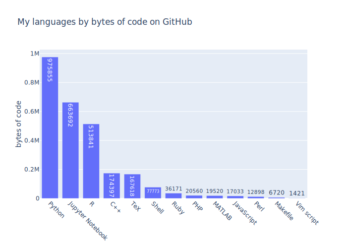
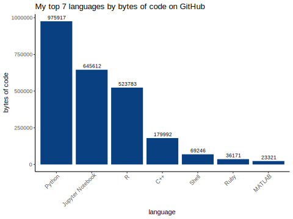
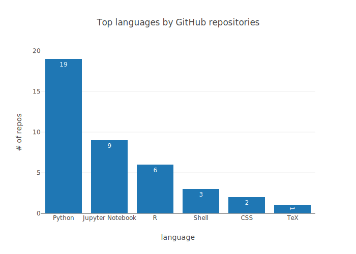

# meta-repo

A meta-repository to organize my public projects.

## Projects

### Current
| Repository | Description | Owner | Language(s) |
|---|---|---|---|
| [kelly-sovacool.github.io](https://github.com/kelly-sovacool/kelly-sovacool.github.io) | My personal website, forked from the academicpages template. | [kelly-sovacool](https://github.com/kelly-sovacool) | Shell |
| [meta-repo](https://github.com/kelly-sovacool/meta-repo) | A meta-repository to organize my public projects. | [kelly-sovacool](https://github.com/kelly-sovacool) | Python, Shell |
| [nocode](https://github.com/kelly-sovacool/nocode) | The best way to write secure and reliable applications. Write nothing; deploy nowhere. | [kelly-sovacool](https://github.com/kelly-sovacool) | Dockerfile |
| [stats-ref](https://github.com/kelly-sovacool/stats-ref) | A reference for concepts & equations in statistics. | [kelly-sovacool](https://github.com/kelly-sovacool) | Python, CSS |
| [snakemake_tutorial](https://github.com/SchlossLab/snakemake_tutorial) | A snakemake tutorial for make users | [SchlossLab](https://github.com/SchlossLab) | Python, R, Makefile, Shell, Rebol |
| [Great_Lakes_SLURM](https://github.com/SchlossLab/Great_Lakes_SLURM) | Using the Great Lakes cluster and batch computing with SLURM  | [SchlossLab](https://github.com/SchlossLab) |  |
| [git-novice](https://github.com/kelly-sovacool/git-novice) | Software Carpentry introduction to Git for novices. | [kelly-sovacool](https://github.com/kelly-sovacool) | Python, HTML, CSS, R, Makefile, JavaScript, Ruby, Shell |
| [schlosslab.github.io](https://github.com/SchlossLab/schlosslab.github.io) | The website for the Schloss Lab at the University of Michigan | [SchlossLab](https://github.com/SchlossLab) | CSS, HTML, Ruby |
| [PyCon_2019](https://github.com/GabrielleRab/PyCon_2019) | Repository for PyCon 2019 Education Summit Mini-Sprint: Workbooks that teach Python through scientific data exploration | [GabrielleRab](https://github.com/GabrielleRab) | Jupyter Notebook |
| [umswc.github.io](https://github.com/kelly-sovacool/umswc.github.io) | UM Software and Data Carpentry Website | [kelly-sovacool](https://github.com/kelly-sovacool) | CSS, HTML, Python, Ruby |
| [fitness-geek](https://github.com/kelly-sovacool/fitness-geek) | Having fun with my Strava data! | [kelly-sovacool](https://github.com/kelly-sovacool) | Python |
| [latex-cv](https://github.com/kelly-sovacool/latex-cv) | My curriculum vitae in LaTeX + a Snakemake pipeline for compiling tex to pdf. | [kelly-sovacool](https://github.com/kelly-sovacool) | TeX, Python, Shell |
| [documenting-R](https://github.com/SchlossLab/documenting-R) | Materials for a code review on documenting R code. | [SchlossLab](https://github.com/SchlossLab) | R |
| [SummerExperience](https://github.com/GWC-DCMB/SummerExperience) | materials for our Data Science Summer Experience  | [GWC-DCMB](https://github.com/GWC-DCMB) | Jupyter Notebook |
| [snakemake_hpc_mwe](https://github.com/kelly-sovacool/snakemake_hpc_mwe) | A minimal working example of using Snakemake on the HPC | [kelly-sovacool](https://github.com/kelly-sovacool) | Python, Shell |
| [CapstoneProject](https://github.com/GWC-DCMB/CapstoneProject) | Capstone Project Information for 2017-2018 GWC | [GWC-DCMB](https://github.com/GWC-DCMB) | Jupyter Notebook, HTML, Python |
| [advent-of-code-2018](https://github.com/kelly-sovacool/advent-of-code-2018) | My solutions to the Advent of Code 2018 puzzles. | [kelly-sovacool](https://github.com/kelly-sovacool) | Jupyter Notebook, Python, Shell |
| [tiger_salamander_project](https://github.com/kelly-sovacool/tiger_salamander_project) | SNP pipeline using Snakemake for the Weisrock Lab's Tiger Salamander project. | [kelly-sovacool](https://github.com/kelly-sovacool) | Python, Shell |
| [codeDemos](https://github.com/GWC-DCMB/codeDemos) | Coding demos for Python instruction in Girls Who Code Club | [GWC-DCMB](https://github.com/GWC-DCMB) | Jupyter Notebook, Python |

### Stale
| Repository | Description | Owner | Language(s) |
|---|---|---|---|
| [tcf-words](https://github.com/c-andy-martin/tcf-words) | TCF Overhead Words | [c-andy-martin](https://github.com/c-andy-martin) |  |
| [useful-programs](https://github.com/thesuperlab/useful-programs) | None | [thesuperlab](https://github.com/thesuperlab) | Python, Shell |

### Archive
| Repository | Description | Owner | Language(s) |
|---|---|---|---|
| [lang-stats](https://github.com/kelly-sovacool/lang-stats) | Collect & plot personal programming language statistics from GitHub repos | [kelly-sovacool](https://github.com/kelly-sovacool) | Python |
| [miRNA-diff-expr](https://github.com/kelly-sovacool/miRNA-diff-expr) | Differential expression analysis for miRNA sequence data | [kelly-sovacool](https://github.com/kelly-sovacool) | R |
| [undergrad-comp-sci](https://github.com/kelly-sovacool/undergrad-comp-sci) | A collection of code I wrote for assignments in computer science courses as an undergraduate student at the University of Kentucky (2014-2018). | [kelly-sovacool](https://github.com/kelly-sovacool) | Python, C++, Ruby, PHP, JavaScript, Perl, R, HTML, CSS, Makefile, CoffeeScript |
| [dmrr-submission-prep](https://github.com/kelly-sovacool/dmrr-submission-prep) | Prepare miRNA metadata for submission to the exRNA Data Coordination Center | [kelly-sovacool](https://github.com/kelly-sovacool) | Jupyter Notebook, Python |
| [geo109-project](https://github.com/kelly-sovacool/geo109-project) | Lexington collision maps for GEO109 | [kelly-sovacool](https://github.com/kelly-sovacool) | Python |

### Gists
| Description |
|---|
| [Test conda environments on HPC batch scheduler](https://gist.github.com/21289d9ce89302a81996380f70814f7d) |
| [Google Drive file I/O with Colab Jupyter notebooks](https://gist.github.com/c33b64b70164be37d75bd40c9b56b498) |
| [Implementation of binary numbers & arithmetic for education](https://gist.github.com/8f263d9689c849c8cd7d86bd03044409) |
| [Plotting the titanic data: task for the Schloss lab code review led by Begüm](https://gist.github.com/e758ec7a0b6fb3724a3f19f3fdc1cdff) |

## Usage

The [table above](#current) and [plots below](#plots) are generated by the script [`git-repos.py`](git-repos.py).

### Setup

1. Clone this repo:

    ```
    git clone https://github.com/kelly-sovacool/meta-repo
    ```

1. Change the URL to your own GitHub repo:

    ```
    git remote set-url origin https://github.com/USERNAME/REPOSITORY.git
    ```

1. Install dependencies:

    ```
    conda env create -n git-repos -f environment.yaml
    conda activate git-repos
    ```

### Run it

Get your repos & make plots with:

```
python git-repos.py --username your_username
```

It will then prompt you for your GitHub password, collect the information from GitHub, and generate the table in [`README.md`](README.md) under the [`Projects`](#projects) subheading.
[Plots](##plots) of programming language statistics are written to [`figures/`](figures/).
Only repositories which you own or which you have contributed to are included.

Alternatively, you can supply an [access token](https://help.github.com/en/articles/creating-a-personal-access-token-for-the-command-line) instead of your username & password.
Paste the token into a plain text file and use the `--token` option:

```
python git-repos.py --token path_to_token
```

#### Private repos

By default, private repos are excluded from the table.
However, they are always included in statistics for plots.
If you wish to include them, use the flag `--include_private`:

```
python git-repos.py --token path_to_token --include_private
```
or
```
python git-repos.py --username your_username --include_private
```


## Plots

Plots of programming language statistics are written to [`figures/`](figures/).







## TO-DO

- Jupyter is way over-represented because `.ipynb` files are JSON with lots of metadata.
    - It'd be cool to parse out the code chunks and only let code count towards the byte count.
    - Does linguist count comments in regular text files (e.g. `.py` or `.R`) towards the code byte count?
    - Try counting bytes in regular `.py` files to make sure my method matches that of linguist, then apply it to Jupyter code chunks stripped of metadata.
