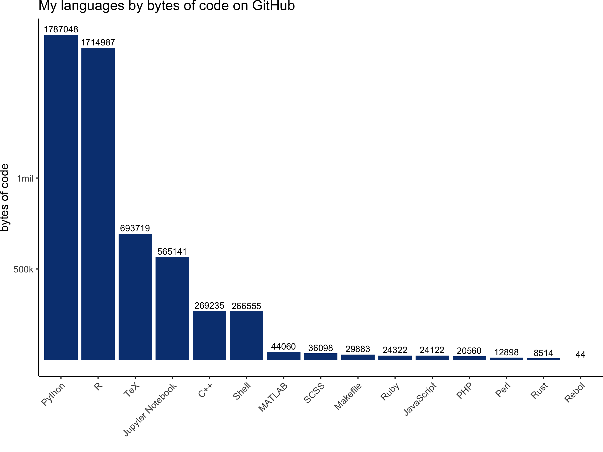
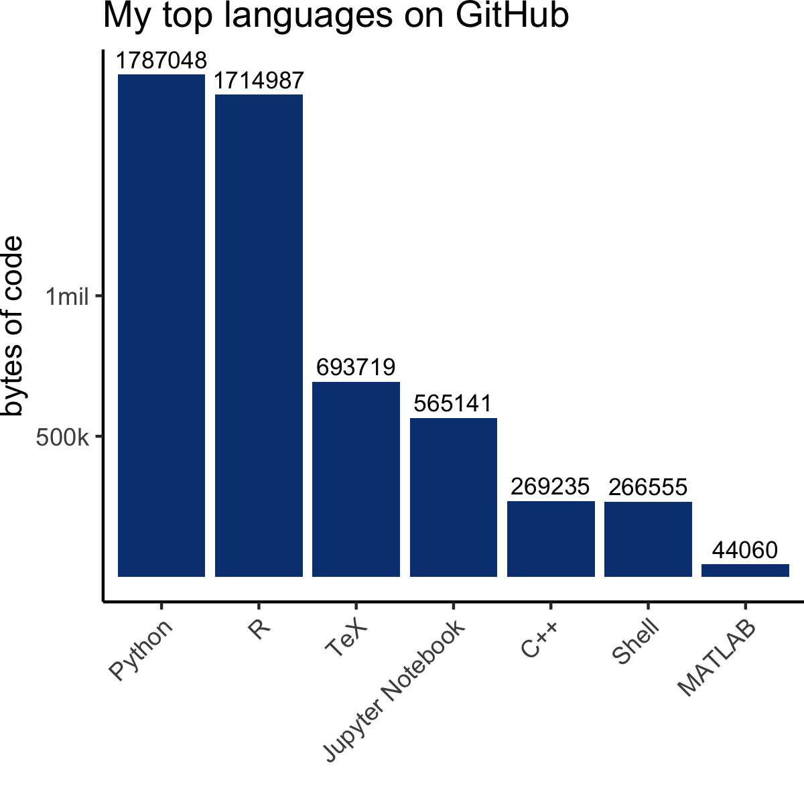
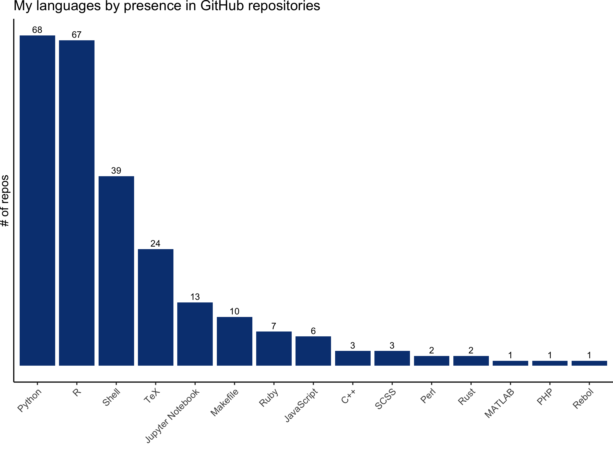

# meta-repo
[](https://github.com/kelly-sovacool/meta-repo/actions)

A meta-repository to organize my public projects.

- [Projects](#projects)
- [Usage Instructions](#usage)
- [Plots](#plots)
## Projects

### Current
| Repository | Description | Owner | Language(s) |
|---|---|---|---|
| [ClubCurriculum](https://github.com/GWC-DCMB/ClubCurriculum) | Curriculum for our weekly club for high school students. | [GWC-DCMB](https://github.com/GWC-DCMB) | Jupyter Notebook, Python |
| [GWC-DCMB](https://github.com/GWC-DCMB/GWC-DCMB) | A meta-repository to help navigate the repos and resources of Girls Who Code at UM-DCMB. | [GWC-DCMB](https://github.com/GWC-DCMB) | Python, Shell |
| [SummerExperience](https://github.com/GWC-DCMB/SummerExperience) | Curriculum & materials for our week-long Data Science Summer Experience. | [GWC-DCMB](https://github.com/GWC-DCMB) | Jupyter Notebook, Python |
| [meta-repo](https://github.com/kelly-sovacool/meta-repo) | A meta-repository to organize my public projects. | [kelly-sovacool](https://github.com/kelly-sovacool) | Python, R, Shell |
| [caret](https://github.com/kelly-sovacool/caret) | caret (Classification And Regression Training) R package that contains misc functions for training and plotting classification and regression models | [kelly-sovacool](https://github.com/kelly-sovacool) | R, HTML, TeX, CSS, C |
| [ML_pipeline_microbiome](https://github.com/SchlossLab/ML_pipeline_microbiome) |  | [SchlossLab](https://github.com/SchlossLab) | R, Shell |
| [strava](https://github.com/kelly-sovacool/strava) | Having fun plotting my activity data from Strava! | [kelly-sovacool](https://github.com/kelly-sovacool) | R, Python, Shell |
| [latex-cv](https://github.com/kelly-sovacool/latex-cv) | My curriculum vitae in LaTeX + a Snakemake pipeline for compiling tex to pdf. | [kelly-sovacool](https://github.com/kelly-sovacool) | TeX, Python, Shell |
| [CapstoneProject](https://github.com/GWC-DCMB/CapstoneProject) | Capstone Project datasets & instructions. | [GWC-DCMB](https://github.com/GWC-DCMB) | Jupyter Notebook |
| [build-tidy-tools](https://github.com/kelly-sovacool/build-tidy-tools) | Materials & my notes from Building Tidy Tools workshop at rstudio::conf(2020) | [kelly-sovacool](https://github.com/kelly-sovacool) | R |
| [umswc.github.io](https://github.com/UMSWC/umswc.github.io) | UM Software and Data Carpentry Website | [UMSWC](https://github.com/UMSWC) | CSS, HTML, Python, Ruby |
| [um-dang.github.io](https://github.com/um-dang/um-dang.github.io) | Website for the Data Analysis Networking Group at U-M. | [um-dang](https://github.com/um-dang) |  |
| [2020-01-06-UMich-WISE](https://github.com/UMSWC/2020-01-06-UMich-WISE) | Software Carpentry workshop for WISE at U-M | [UMSWC](https://github.com/UMSWC) | Python, HTML, CSS, R, Makefile, JavaScript, Shell, Ruby |
| [omu-prototype](https://github.com/SchlossLab/omu-prototype) | A tool to cluster features from untargeted mass spectrometry experiments into Operational Metabolomic Units (OMU) | [SchlossLab](https://github.com/SchlossLab) | Python |
| [challengeQuestions](https://github.com/GWC-DCMB/challengeQuestions) | Jupyter notebooks of challenge questions for learners. | [GWC-DCMB](https://github.com/GWC-DCMB) | Jupyter Notebook, Python |
| [jupyter-ci-mwe](https://github.com/kelly-sovacool/jupyter-ci-mwe) | A minimal working example of using continuous integration to convert jupyter notebooks to PDFs. | [kelly-sovacool](https://github.com/kelly-sovacool) | Jupyter Notebook |
| [kelly-sovacool.github.io](https://github.com/kelly-sovacool/kelly-sovacool.github.io) | My personal website, forked from the academicpages template. | [kelly-sovacool](https://github.com/kelly-sovacool) | Shell |
| [tiger_salamander_project](https://github.com/kelly-sovacool/tiger_salamander_project) | SNP pipeline using Snakemake for the Weisrock Lab's Tiger Salamander project. | [kelly-sovacool](https://github.com/kelly-sovacool) | Python, Shell |
| [schlosslab.github.io](https://github.com/SchlossLab/schlosslab.github.io) | The website for the Schloss Lab at the University of Michigan | [SchlossLab](https://github.com/SchlossLab) | CSS, HTML, Ruby |
| [codeDemos](https://github.com/GWC-DCMB/codeDemos) | Stand-alone Python coding demos. | [GWC-DCMB](https://github.com/GWC-DCMB) | Jupyter Notebook, Python |
| [documenting-R](https://github.com/SchlossLab/documenting-R) | Materials for a code review on documenting R code. | [SchlossLab](https://github.com/SchlossLab) | R |
| [exception-handling](https://github.com/SchlossLab/exception-handling) | Materials for a code review on exception handling in R for lab meeting. | [SchlossLab](https://github.com/SchlossLab) | R |
| [snakemake_riffomonas_tutorial](https://github.com/SchlossLab/snakemake_riffomonas_tutorial) | A snakemake tutorial for make users | [SchlossLab](https://github.com/SchlossLab) | R, Python, Makefile, Shell |
| [loops-apply-r](https://github.com/um-dang/loops-apply-r) | Looping in R: for loops & the apply family  | [um-dang](https://github.com/um-dang) |  |
| [snakemake_hpc_mwe](https://github.com/kelly-sovacool/snakemake_hpc_mwe) | A minimal working example of using Snakemake on an HPC running PBS-torque or SLURM. | [kelly-sovacool](https://github.com/kelly-sovacool) | Shell, Python |
| [machine-learning-pipelines-r](https://github.com/um-dang/machine-learning-pipelines-r) | Machine Learning Pipelines in R: Predict colorectal cancer using microbiome data | [um-dang](https://github.com/um-dang) | R |
| [tcf-words](https://github.com/c-andy-martin/tcf-words) | TCF Overhead Words | [c-andy-martin](https://github.com/c-andy-martin) |  |
| [ozobotLessons](https://github.com/GWC-DCMB/ozobotLessons) | Lesson plans for Ozobots. | [GWC-DCMB](https://github.com/GWC-DCMB) | HTML |
| [writing-functions-r](https://github.com/um-dang/writing-functions-r) | Introduction to writing functions in R | [um-dang](https://github.com/um-dang) | R |
| [FEMMES](https://github.com/GWC-DCMB/FEMMES) | Resources for activities for U-M FEMMES. | [GWC-DCMB](https://github.com/GWC-DCMB) |  |
| [Great_Lakes_SLURM](https://github.com/SchlossLab/Great_Lakes_SLURM) | Using the Great Lakes cluster and batch computing with SLURM  | [SchlossLab](https://github.com/SchlossLab) |  |

### Stale
| Repository | Description | Owner | Language(s) |
|---|---|---|---|
| [git_update](https://github.com/akhagan/git_update) | Updating SWC git lessons with the puzzle analogy | [akhagan](https://github.com/akhagan) | HTML, Python, CSS, R, Makefile, JavaScript, Ruby, Shell |
| [stats-ref](https://github.com/kelly-sovacool/stats-ref) | A reference for concepts & equations in statistics. | [kelly-sovacool](https://github.com/kelly-sovacool) | Python, CSS |
| [PyCon_2019](https://github.com/GabrielleRab/PyCon_2019) | Repository for PyCon 2019 Education Summit Mini-Sprint: Workbooks that teach Python through scientific data exploration | [GabrielleRab](https://github.com/GabrielleRab) | Jupyter Notebook |
| [advent-of-code-2018](https://github.com/kelly-sovacool/advent-of-code-2018) | My solutions to the Advent of Code 2018 puzzles. | [kelly-sovacool](https://github.com/kelly-sovacool) | Jupyter Notebook, Python, Shell |
| [useful-programs](https://github.com/thesuperlab/useful-programs) |  | [thesuperlab](https://github.com/thesuperlab) | Python, Shell |

### Archive
| Repository | Description | Owner | Language(s) |
|---|---|---|---|
| [foofactors](https://github.com/kelly-sovacool/foofactors) | Practice from Building Tidy Tools workshop at rstudio::conf(2020) | [kelly-sovacool](https://github.com/kelly-sovacool) | R |
| [fordogs](https://github.com/kelly-sovacool/fordogs) | Practice from Building Tidy Tools workshop at rstudio::conf(2020) | [kelly-sovacool](https://github.com/kelly-sovacool) | R |
| [recipes-kelly](https://github.com/kelly-sovacool/recipes-kelly) | Teaching git at WISE Software Carpentry Workshop 2020-01-07 | [kelly-sovacool](https://github.com/kelly-sovacool) |  |
| [tidytest](https://github.com/kelly-sovacool/tidytest) | Practice from Building Tidy Tools workshop at rstudio::conf(2020) | [kelly-sovacool](https://github.com/kelly-sovacool) | R |
| [planets-kelly](https://github.com/kelly-sovacool/planets-kelly) | Teaching git at Software Carpentry Workshop 2019-07-01 | [kelly-sovacool](https://github.com/kelly-sovacool) |  |
| [bioinf603-fall2019](https://github.com/kelly-sovacool/bioinf603-fall2019) | Presentation for BIOINF 603: Journal Club | [kelly-sovacool](https://github.com/kelly-sovacool) |  |
| [geo109-project](https://github.com/kelly-sovacool/geo109-project) | Lexington collision maps for GEO109 | [kelly-sovacool](https://github.com/kelly-sovacool) | Python |
| [undergrad-comp-sci](https://github.com/kelly-sovacool/undergrad-comp-sci) | A collection of code I wrote for assignments in computer science courses as an undergraduate student at the University of Kentucky (2014-2018). | [kelly-sovacool](https://github.com/kelly-sovacool) | Python, C++, Ruby, PHP, JavaScript, Perl, R, HTML, CSS, Makefile |
| [lang-stats](https://github.com/kelly-sovacool/lang-stats) | Collect & plot personal programming language statistics from GitHub repos | [kelly-sovacool](https://github.com/kelly-sovacool) | Python |
| [miRNA-diff-expr](https://github.com/kelly-sovacool/miRNA-diff-expr) | Differential expression analysis for miRNA sequence data | [kelly-sovacool](https://github.com/kelly-sovacool) | R |
| [dmrr-submission-prep](https://github.com/kelly-sovacool/dmrr-submission-prep) | Prepare miRNA metadata for submission to the exRNA Data Coordination Center | [kelly-sovacool](https://github.com/kelly-sovacool) | Jupyter Notebook, Python |

### Gists
| Description |
|---|
| [](https://gist.github.com/ac8b5db07c4ae35266701266cb1d0238) |
| [Comparing runtime of a for loop vs list comprehensions for a permutation test](https://gist.github.com/bb8589d233887fdb783e23d7bfb03414) |
| [Notes on software performance analysis](https://gist.github.com/cc056f236f4363347fafb62fbdbc694f) |
| [Monte Carlo simulation to estimate the value of Pi](https://gist.github.com/d58f051059720b3b21841209a3abe48a) |
| [Lab Meeting Code Review 2019-09-30: Visualizing weights of model features](https://gist.github.com/dcba52ab03f09023f39662294ca8d803) |
| [The first program I ever wrote! In 10th grade I was inspired by my biomedical science class. Saved here for posterity.](https://gist.github.com/883342d825ff17f2271cd240c26f2cd2) |
| [Keybase proof](https://gist.github.com/1626a05ca82e3863da7f92e73097efe8) |
| [My bio for the GWC-DCMB website](https://gist.github.com/3f307b86dc7e868c923ad234bf144a93) |
| [Test conda environments on HPC batch scheduler](https://gist.github.com/21289d9ce89302a81996380f70814f7d) |
| [Google Drive file I/O with Colab Jupyter notebooks](https://gist.github.com/c33b64b70164be37d75bd40c9b56b498) |
| [Implementation of binary numbers & arithmetic for education](https://gist.github.com/8f263d9689c849c8cd7d86bd03044409) |
| [Plotting the titanic data: task for the Schloss lab code review led by Begüm](https://gist.github.com/e758ec7a0b6fb3724a3f19f3fdc1cdff) |

## Usage

The [table above](#current) and [plots below](#plots) are generated by the snakemake workflow in the [`Snakefile`](Snakefile).

### Setup

1. Clone this repo:

    ```
    git clone https://github.com/kelly-sovacool/meta-repo
    ```

1. Change the URL to your own GitHub repo:

    ```
    git remote set-url origin https://github.com/USERNAME/REPOSITORY.git
    ```

1. Install dependencies:

    ```
    conda env create -n git-repos -f config/environment.yaml
    conda activate git-repos
    ```

1. Generate an [access token](https://help.github.com/en/articles/creating-a-personal-access-token-for-the-command-line) and paste it into a plain text file. Create a YAML file `config/config.yml` with the path to your token file:

    ```
    token_filename: path/to/token
    ```

    Don't share your token with anyone!

### Run it

Run the whole workflow with:

```
snakemake
```

It will collect information about repos you contribute to, write the data to
[csv](data/repo_languages.csv), update the README [`projects`](#projects) table,
& make [plots](##plots).

Don't edit the README file directly.
You can edit the [head](config/head.md) and [tail](config/tail.md) to modify
what appears before and after the projects table.

#### Alternate workflow

If you don't want to use snakemake, you can run the Python & R scripts in [`code/`](code).

```
python code/GitHubLangStats.py --token path_to_token
```

It will then collect the information from GitHub, write a csv file to [`data/`](data),
and generate the table in [`README.md`](README.md) under the [`Projects`](#projects) subheading.
Only repositories which you own or which you have contributed to are included.

Alternatively, you can supply your username. It will then prompt you for your password:
```
python code/GitHubLangStats.py --username your_username
```

To update the plots, run the R script:
```
R -e "source('code/plot_language_stats.R')"
```

[Plots](##plots) of programming language statistics are written to [`figures/`](figures/).

#### Private repos

By default, private repos are excluded from the table.
However, they are always included in statistics for plots.
If you wish to include them, use the flag `--include_private`:

```
python code/GitHubLangStats.py --token path_to_token --include_private
```
or
```
python code/GitHubLangStats.py --username your_username --include_private
```

## Plots






